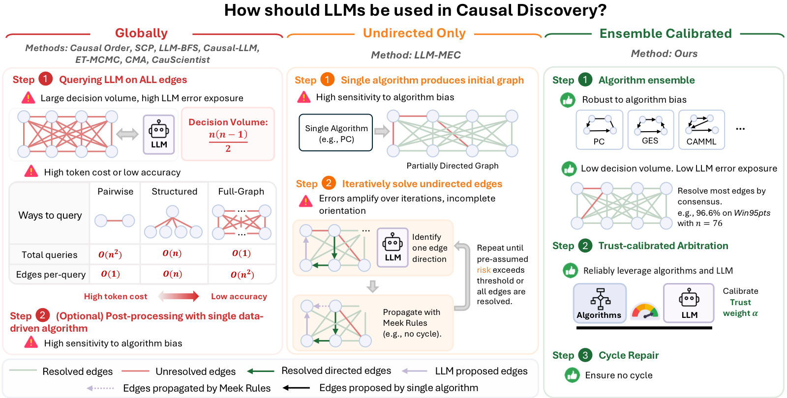
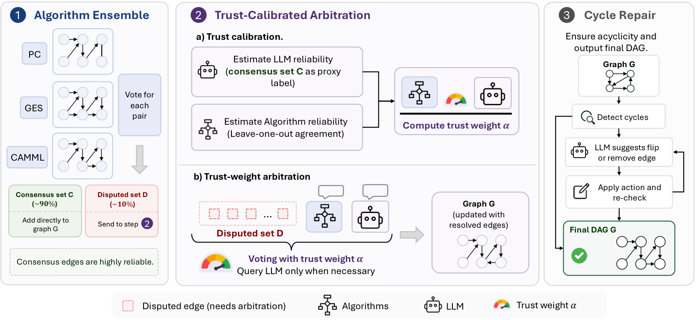

# CauTion: Knowing When to Trust LLMs for Ensemble Causal Discovery

  

<em><b>Figure 1:</b> Comparison of existing methods and CauTion. <b>Global methods</b> query the LLM across all O(n²) variable pairs with high LLM error exposure. The O(n²) decision volume incurs either high token cost or low accuracy. <b>Undirected-only methods</b> suffer from error amplification over iterations and incomplete orientation. In both categories, when a data-centric algorithm is incorporated, the final graph is vulnerable to the individual algorithm bias. On the other hand, CauTion addresses these limitations via algorithm ensemble and trust-calibrated arbitration, enabling reliable integration robust to both LLM and single algorithm errors.</em>

## Abstract

Causal discovery from observational data remains challenging due to the fundamental limitations of purely statistical methods, such as statistical distinguishability within equivalence classes and sensitivity to finite sample sizes. While large language models (LLMs) offer a promising source of domain knowledge to complement statistical inference, existing LLM-augmented methods are vulnerable to LLM errors and incur high token costs. Moreover, reliance on a single data-centric algorithm can make results sensitive to algorithm-specific biases. To address these limitations, we propose CauTion, a framework that reliably integrates LLM domain knowledge into an ensemble of statistical causal discovery algorithms through consensus filtering and LLM reliability estimation. CauTion proceeds in three stages. First, an algorithm ensemble utilizes a consensus voting to resolve up to 96% of edges on which algorithms agree, achieving near-perfect accuracy on the filtered consensus edges. Second, a trust-calibrated arbitration mechanism estimates the relative reliability of the LLM and the algorithms via an annotation-free trust calibration procedure, which is then utilized to govern a trust-weighted voting process that restricts LLM arbitration exclusively to edges with unreliable algorithmic evidence. Third, a cycle repair step is applied to guarantee the final causal graph is validly acyclic. Experiments on six datasets demonstrate that CauTion consistently outperforms both data-centric and LLM-augmented baselines, with larger gains on larger graphs and strong robustness to LLM errors.

  

<em><b>Figure 2:</b> Overview of CauTion. 1) We first aggregate outputs from multiple causal discovery algorithms (PC, GES, CAMML) and partition variable pairs into consensus and disputed sets. Consensus edges are resolved directly, leaving disputed edges for further arbitration. 2) We use the consensus set as proxy labels to estimate the reliability of LLM, while using leave-one-out to estimate the algorithms. Then compute the calibrated trust weight, which is used for LLM arbitration. 3) A final cycle-repair step ensures acyclicity of the output graph.</em>

## Code

🚧 Coming soon.
